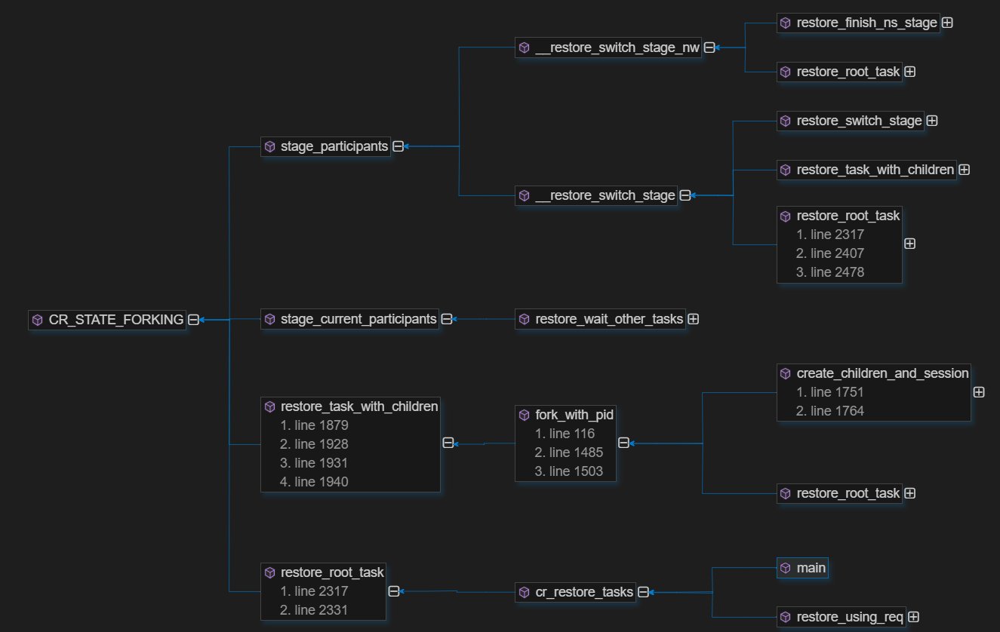

# CRIU-Restore恢复过程分析

## 0. 恢复过程中用到的重要的结构体

这里定义了需要从镜像文件中获取的信息

```c
struct collect_image_info {
    int fd_type;
    int pb_type;
    unsigned int priv_size;
    int (*collect)(void *, ProtobufCMessage *,  struct cr_img *);
    unsigned flags;
};

struct cr_img {
    union {
        struct bfd _x;
        struct {
            int fd; /* should be first to coincide with _x.fd */
            int type;
            unsigned long oflags;
            char *path;
        };
    };
};

struct bfd {
    int fd;
    bool writable;
    struct xbuf b;
};

```

这里定义了两个`collect_image_info`类型的数组`cinfos`和`cinfos_files`，按序保存需要收集的信息，如文件锁，无名管道数据，有名管道fifo文件数据，sockets等等。

```c

static struct collect_image_info *cinfos[] = {
	&file_locks_cinfo,
	&pipe_data_cinfo,
	&fifo_data_cinfo,
	&sk_queues_cinfo,
};

static struct collect_image_info *cinfos_files[] = {
	&unix_sk_cinfo,
	&fifo_cinfo,
	&pipe_cinfo,
	&nsfile_cinfo,
	&packet_sk_cinfo,
	&netlink_sk_cinfo,
	&eventfd_cinfo,
	&epoll_cinfo,
	&epoll_tfd_cinfo,
	&signalfd_cinfo,
	&tunfile_cinfo,
	&timerfd_cinfo,
	&inotify_cinfo,
	&inotify_mark_cinfo,
	&fanotify_cinfo,
	&fanotify_mark_cinfo,
	&ext_file_cinfo,
	&memfd_cinfo,
};

```

恢复过程由criu进程启动，然后得到所有相关任务的确认。之后criu执行一些操作并启动下一个stage。

阶段顺序如下：

```c
static inline int stage_participants(int next_stage)
{
	switch (next_stage) {
	case CR_STATE_FAIL:
		return 0;
	case CR_STATE_ROOT_TASK:        //创建root task
	case CR_STATE_PREPARE_NAMESPACES:   //准备命名空间
		return 1;
	case CR_STATE_FORKING:
		return task_entries->nr_tasks + task_entries->nr_helpers;
	case CR_STATE_RESTORE:
		return task_entries->nr_threads + task_entries->nr_helpers;
	case CR_STATE_RESTORE_SIGCHLD:
	case CR_STATE_RESTORE_CREDS:
		return task_entries->nr_threads;
	}

	BUG();
	return -1;
}
```

开始阶段是`CR_STATE_ROOT_TASK`，这一步从进程树的根节点root开始处理，在为`root_item`调用`fork_with_pid()`之前开始。

上面所做的在`CR_STATE_FORKING`之前的阶段是为了减少从root task到criu的上下文切换量，因为criu不需要单独的分叉阶段，这纯粹是为了确保所有任务同步。

##  处理共享资源

```c
static int root_prepare_shared(void)
{
    ...
    pr_info("Preparing info about shared resources\n");
    if (prepare_remaps())   //准备重新映射的关系
		return -1;

	if (seccomp_read_image())   //secure computing mode
		return -1;

    if (collect_images(cinfos, ARRAY_SIZE(cinfos))) 
    //遍历cinfos，收集文件锁，无名管道数据，有名管道fifo数据，sockets的信息
		return -1;

	if (!files_collected() &&
			collect_images(cinfos_files, ARRAY_SIZE(cinfos_files)))
    //遍历cinfos_files,收集每个对应元素需要的信息
		return -1;

    //遍历进程树中的每项，处理其中共享的资源。

    //错误信息的处理
    //return ret;
}
```
根据调用关系图，分析restore过程




首先查看主函数中restore部分的入口

```c
if (!strcmp(argv[optind], "restore")) {
    if (opts.tree_id)
		pr_warn("Using -t with criu restore is obsoleted\n");
		ret = cr_restore_tasks();
	if (ret == 0 && opts.exec_cmd) {
		close_pid_proc();
		execvp(opts.exec_cmd[0], opts.exec_cmd);
		pr_perror("Failed to exec command %s", opts.exec_cmd[0]);
		ret = 1;
	}
    return ret != 0;
}
```

`cr_restore_tasks`执行一些初始化以及检查操作，在函数最后调用`int restore_root_task(struct pstree_item *init)`，对root_task进行恢复。

由restore部分的宏定义中描述可知（restore.h），`CR_STATE_FORKING`是恢复阶段的主要部分，同时也说明了该部分几乎完成了所有任务的恢复，除了：
1. 拉起zombies和helpers
2. 用于检测恢复错误的restore sigchild handlers
3. 恢复授信文件(credentials)，安全计算模式(seccomp)，dumpable和pdeath_sig

下面观察一下`CR_STATE_FORKING`其他部分

```c
static int restore_task_with_children(void *_arg)
{
    ...200+行，不贴在这里了
    //task表示当前的恢复任务
    //如果所有tasks都在一组cgroups中，
    //我们只需要移动root到这里，其他的通过它继承。
    ...
    if (!files_collected() && collect_image(&tty_cinfo))
			goto err;
		if (collect_images(before_ns_cinfos, ARRAY_SIZE(before_ns_cinfos)))
			goto err;

		if (prepare_namespace(current, ca->clone_flags))
			goto err;

		if (restore_finish_ns_stage(CR_STATE_PREPARE_NAMESPACES, CR_STATE_FORKING) < 0)
			goto err;

		if (root_prepare_shared())
			goto err;

		if (populate_root_fd_off())
			goto err;
    ...

    ...
    /*
		 * 等待所有任务通过 CR_STATE_FORKING 阶段（stage）.
		 * 这个阶段由criu启动, 但现在等CR_STATE_RESTORE来完成。 
		 * 这意味着所有tasks进入到他们的namespaces
		 */
    if (current->parent == NULL) {
		
		if (restore_wait_other_tasks())
			goto err;
		fini_restore_mntns();
		__restore_switch_stage(CR_STATE_RESTORE);
	} else {
		if (restore_finish_stage(task_entries, CR_STATE_FORKING) < 0)
			goto err;
	}

    ...

}
```


